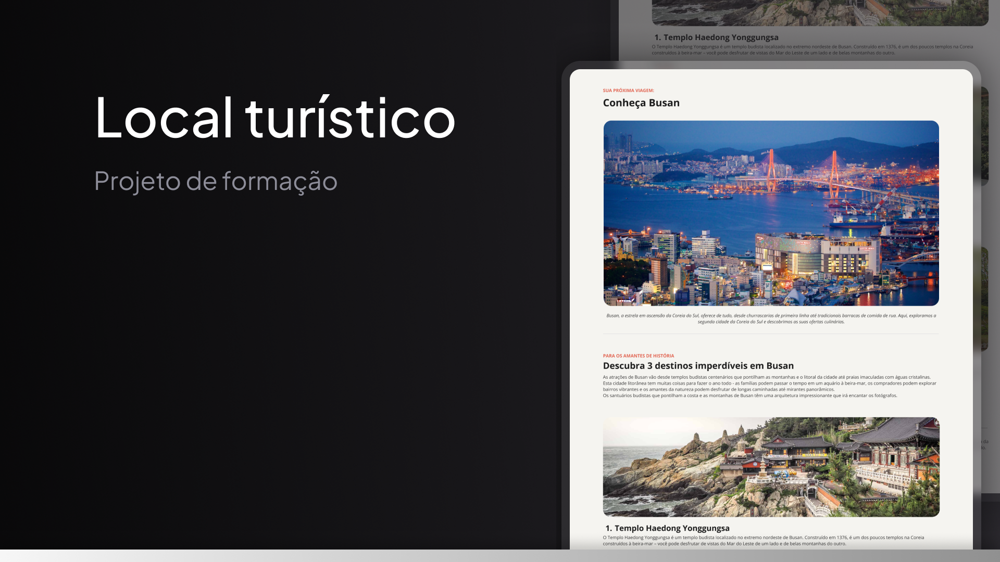

# 🌍 Tourism Page  
<h1 align="center"> Tourism Page </h1>

  A project developed to improve my skills in web development. This project showcases a simple and functional tourism webpage focused on delivering a visually appealing design and implementing modern best practices.

  Designed to inspire users to explore new destinations and plan unforgettable trips, this project highlights key HTML and CSS fundamentals.  
  <a href="https://santiaghou.github.io/tourism-page/">Click here to view this project in action.</a>

  <a href="#-technologies">Technologies</a>&nbsp;&nbsp;&nbsp;|&nbsp;&nbsp;&nbsp;
  <a href="#-project">Project</a>&nbsp;&nbsp;&nbsp;|&nbsp;&nbsp;&nbsp;
  <a href="#-layout">Layout</a>&nbsp;&nbsp;&nbsp;|&nbsp;&nbsp;&nbsp;
  <a href="#memo-license">License</a>

 

  

## 🚀 Technologies  

This project was developed with the following technologies:

- HTML5 and CSS3  
- Git and GitHub  
- Figma  

## 💻 Project  

The **Tourism Page** is a simple and functional webpage created to display amazing destinations with images, descriptive texts, and a responsive design suitable for any device.  

## 🔖 Layout  

You can view the project layout through [THIS LINK](https://www.figma.com/design/eLw2zuUKUrDKWdNDYBBkf4/Local-Tur%C3%ADstico-(Community)?node-id=0-1&node-type=canvas&t=B8nXpnHFm3A3ynC7-0). To access it, you need a [Figma](https://figma.com) account.  

## :memo: License  

This project is under the **MIT** license.  

---

Made with 🌎 by **[Santiaghou](https://github.com/Santiaghou)** 👋 Let's explore together!  
Designed from  [rocketseat](https://www.rocketseat.com.br/)
